# CloseAI — Chanakya Multi-Agent Orchestration & Security Ledger System

CloseAI is a secure, high-performance multi-agent framework orchestrating a suite of specialized agents (the **Chanakya Agents**) under a centralized blackboard architecture managed by the **RISHI Core Node**. 

The system leverages **Ollama (llama3)** for natural language intent parsing, translates extracted values into a secure decimal math engine, processes evaluations through structured pipelines, and enforces cryptographic auditing at each step.

---

## 🌟 Key Features

- **Centralized Blackboard Architecture**: Run on FastAPI (**RISHI**), allowing real-time SSE stream handshakes, safe concurrent memory updates, and strict memory limits.
- **Ollama-Powered Intent Parsing**: Uses local `llama3` to extract variables securely from unstructured human inputs.
- **Precision Financial Engine**: Safe parsing and normalisation (e.g. converting `12.5%` or `"12.5"` into `0.125` for decimal compliance rules) preventing floating-point inaccuracies.
- **Cryptographic Audit Trails**: Real-time HMAC token comparison and state integrity hashing.
- **Autonomous Multi-Phase Pipeline**: Orchestrates 8 specialized agents across 4 distinct execution phases.

---

## 🏗 System Architecture

The workflow progresses through 4 phases, coordinated by the Orchestrator with RISHI hosting the blackboard and managing session states:

```mermaid
graph TD
    Client[User / Orchestrator] -->|1. Parse natural English| Ollama[Ollama LLM: llama3]
    Ollama -->|2. Extract & Normalise Variables| Client
    Client -->|3. Establish SSE Handshake / Auth| Rishi[RISHI Core Node Server]
    
    subgraph Phase 1: Quantitative Audit
        A1[Deterministic Agent] -->|Math modeling| Rishi
        A2[Auditability Agent] -->|Hash integrity & Immutable Ledger| Rishi
    end
    
    subgraph Phase 2: Qualitative Analysis
        A3[Ethical Compliance Agent] -->|ESG & Ethical validation| Rishi
        A4[Critical Scenario Agent] -->|Edge case stress testing| Rishi
    end
    
    subgraph Phase 3: Reporting & Visuals
        A5[Communication Agent] -->|Executive summaries| Rishi
        A6[Visualization Agent] -->|Visual dashboards & metrics| Rishi
        A7[ESG Reporting Agent] -->|ESG-specific scores| Rishi
    end
    
    subgraph Phase 4: Regulatory Evolution
        A8[Adaptability Agent] -->|Self-correcting / dynamic compliance| Rishi
    end
    
    Rishi -->|4. Push updates| Client
```



---

## 🤖 The Chanakya Agent Registry

The framework registers and runs 8 agents, each focusing on a specific responsibility:

| Phase | Agent ID | Python Script | Primary Responsibility |
|:---|:---|:---|:---|
| **Phase 1: Quantitative** | `AGENT_CHANAKYA_DETERMINISTIC` | `agent_chanakya_deterministic.py` | Runs mathematical modeling and tax/principal logic. |
| | `AGENT_CHANAKYA_AUDITABILITY` | `agent_chanakya_auditability.py` | Logs SHA-256 hashes of input/output configurations to an immutable ledger file. |
| **Phase 2: Qualitative** | `AGENT_CHANAKYA_ETHICAL` | `agent_chanakya_ethical.py` | Validates calculations against moral, compliance, and legal thresholds. |
| | `AGENT_CHANAKYA_CRITICAL` | `agent_chanakya_critical.py` | Runs stress testing and scenario analysis on input variables. |
| **Phase 3: Output** | `AGENT_CHANAKYA_COMMUNICATION` | `agent_chanakya_communication.py` | Generates formatted reports and clear executive summaries. |
| | `AGENT_CHANAKYA_VISUALIZATION` | `agent_chanakya_visualization.py` | Generates visual metrics, text-based chart simulations, and dashboards. |
| | `AGENT_CHANAKYA_ESG` | `agent_chanakya_esg.py` | Computes Environmental, Social, and Governance ratings. |
| **Phase 4: Evolution** | `AGENT_CHANAKYA_ADAPTABILITY` | `agent_chanakya_adaptability.py` | Researches regulatory changes and maps future compliance steps. |

---

## 🔒 Security & Token Verification

To prevent unauthorized blackboard updates, every communication requires a cryptographically-secure authorization header. 

1. **HMAC Protection**: The RISHI node performs token validation via `hmac.compare_digest()` to protect against timing attacks.
2. **Environment Compartmentalization**: Tokens are read from `.env` (which is never pushed to git).
3. **RAM Guardrails**: Built-in OS memory tracking to prevent host out-of-memory crashes. The memory threshold is dynamically set to `92.0%` to handle Ollama's active model footprints.

---

## 🚀 Setup & Execution

### Prerequisites

1. **Python 3.10+**
2. **Ollama**: Install [Ollama](https://ollama.com) and pull the `llama3` model:
   ```bash
   ollama pull llama3:latest
   ```

### 1. Installation
Clone the repository and install the dependencies:
```bash
git clone https://github.com/shubhamsharma0707/CloseAI.git
cd CloseAI
pip install -r requirements.txt
```

### 2. Configure Environment Tokens
Run the one-shot setup script to generate secure tokens for all agent nodes and configure the local RAM parameters:
```bash
python setup_dev.py
```
This generates a `.env` file containing tokens like:
```env
AGENT_TOKEN_RISHI_CORE_NODE=...
AGENT_TOKEN_AGENT_CHANAKYA_DETERMINISTIC=...
CRITICAL_RAM_PERCENT=92.0
```

### 3. Run the Server
Start the RISHI Core Node server (Terminal 1):
```bash
python RISHI.py
```

### 4. Run the Orchestrator
Execute the main Chanakya orchestrator in a separate terminal (Terminal 2):
```bash
python agents/chanakya/orchestrator.py
```

---

## 🧪 Integration Testing

A single-command test suite is provided to launch RISHI, wait for a health check, spin up the Orchestrator to parse unstructured content (e.g., *"$25,400,500 at 12.5% tax"*), verify each agent milestone, and exit cleanly.

```bash
python test_full_workflow.py
```
Upon completion, the test script will output a compliance checklist:
```text
  Milestone checks:
    ✅  LLM intent parsed
    ✅  Principal extracted
    ✅  Tax rate normalised
    ✅  Phase 1 math audit
    ✅  Phase 1 ledger
    ...
  ✅  ALL 12 MILESTONES PASSED
```
